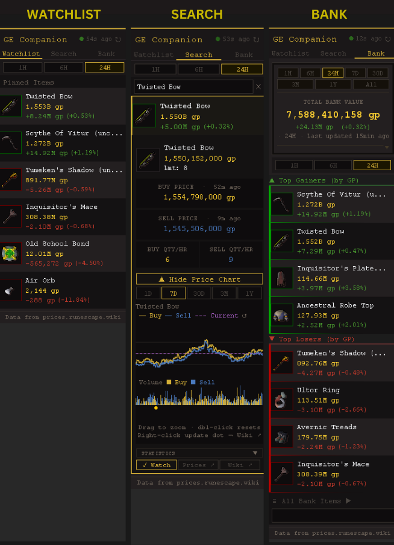
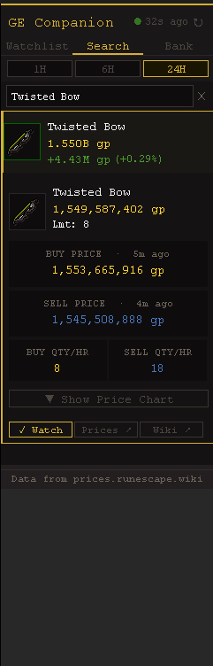
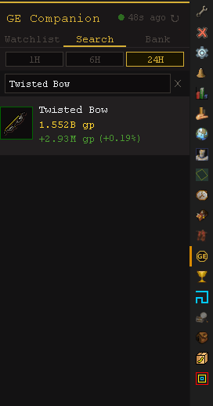
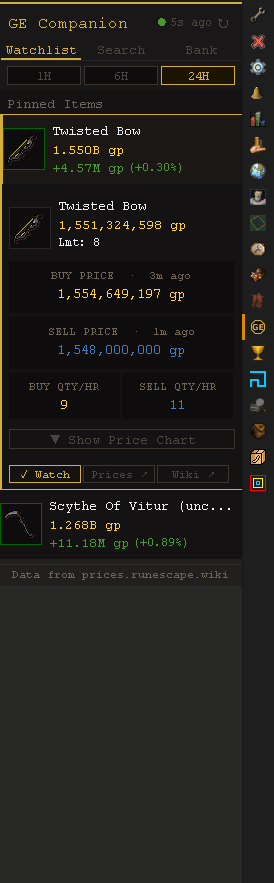
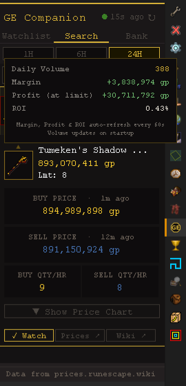
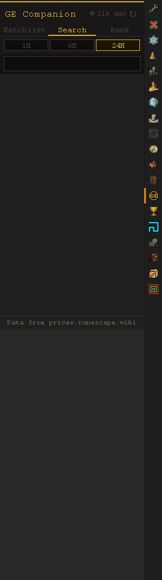
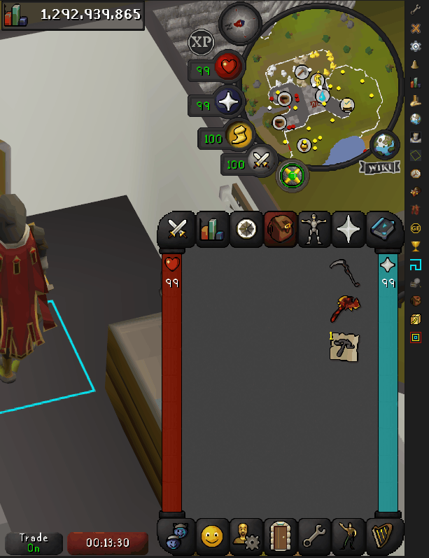

# GE Companion
A RuneLite plugin that brings live Grand Exchange prices, interactive price charts,
a personal watchlist, and bank value tracking directly into your client.

**No account. No API key. No setup. Just install and go.**

---

## Features

### 🔍 Live Price Search
Search any tradeable item by name and get instant results with live prices,
buy/sell volume per hour, and percentage change. Click any item to expand its
detail panel showing:
- Buy Price and Sell Price with last-traded timestamps
- GE buy limit
- Quick links to prices.runescape.wiki and the OSRS Wiki

### 👁️ Watchlist
Pin items to your personal watchlist and monitor their prices at a glance.
Switch between 1H, 6H, and 24H timeframes to track short and medium-term
price movements. Prices auto-refresh every 60 seconds.

### 📈 Interactive Price Chart
Every item has a full buy/sell price history chart with five timeframes:
1D, 7D, 30D, 3M, and 1Y.

**Chart controls:**
- **Drag horizontally** → range zoom to a time window
- **Drag diagonally** → box zoom to lock both time and price axes precisely
- **Middle-click drag** → pan while zoomed in
- **Double-click or ↺** → reset zoom

**Game update markers** appear as colored dots on the timeline showing when
Jagex updates happened — hover to see the update title, right-click to open
the full update on the OSRS Wiki.

Markers are color-coded by category:
- 🟡 **Gold** — General game updates
- 🔵 **Blue** — Patch notes
- 🟢 **Green** — Events
- 🟣 **Purple** — Polls

Choose how many markers to show in plugin settings — All, Major Only, or Off.

Update markers are sourced live from the OSRS Wiki and require no maintenance —
whenever the Wiki documents a new game update, it automatically appears on your
price chart the next time you open it.

### 💡 Flipping Stats
Click the item icon in any detail panel to reveal a flipping stats panel with:
- **Daily Volume** — how many times this item trades per day
- **Margin** — current buy/sell spread
- **Profit at limit** — margin × GE buy limit
- **ROI** — return on investment as a percentage

Margin, Profit, and ROI update live every 60 seconds alongside prices.

### 💰 Bank Value Tracker
Open your bank and GE Companion automatically scans it to show:
- **Total Bank Value** in gp
- **Top Gainers** — your banked items with the biggest price increase
- **Top Losers** — your banked items with the biggest price drop

Switch between 1H, 6H, and 24H to see how your bank is performing over
different timeframes. Expand any item to see its full detail panel and chart.

### 🖱️ Right-click Price Check
Right-click any item in your bank or inventory and select **Price Check**
to instantly pull it up in GE Companion. Works on noted items and
automatically resolves charged, ornamented, and variant items to their
tradeable base.

---

## No Account or API Key Required
All price data comes from the free public OSRS Wiki prices API
(`prices.runescape.wiki`). GE Companion never asks you to log in,
register, or provide any credentials. Install it and it works.

---

## Always Up to Date
Every panel refreshes automatically every 60 seconds with zero disruption —
open detail panels, expanded charts, and floating stats stay exactly where
you left them. Want the latest prices right now? Click the ↻ refresh button
in the top-right corner to force an instant update.

---

## Privacy & Safety
GE Companion only reads publicly available price data from `prices.runescape.wiki`.
It never interacts with the game server on your behalf, never moves items,
and never sends your bank data anywhere. Bank scanning uses RuneLite's standard
item container events — the same approach used by the official RuneLite Bank plugin.
All data stays on your machine.

---

## Configuration

| Setting | Default | Description |
|---|---|---|
| Default tab | Search | Which tab opens on startup |
| Chart zoom mode | Drag Select & Pan | Drag Select & Pan or Magnifier |
| Default chart timeframe | 7D | Starting timeframe for price charts |
| Game update markers | All | Off / Major Only / All |
| Right-click item lookup | On | Show Price Check in right-click menus |
| Sort mode | GP Change | Sort gainers/losers by % Change or GP Change |
| Top Gainers count | 5 | How many gainers to display (1–10) |
| Top Losers count | 5 | How many losers to display (1–10) |
| Min bank item value | 50,000 gp | Minimum stack value to appear in gainers/losers |
| Show bank value change | On | Track and display bank value history |

---

*Data from [prices.runescape.wiki](https://prices.runescape.wiki)*